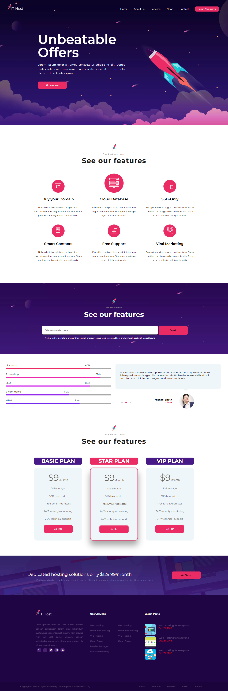

# IT HOST - HTML & CSS Portfolio Website

This repository contains the code for **IT HOST**, a simple portfolio website designed to showcase web design skills using HTML and CSS. The site provides an attractive, clean layout that highlights sections for projects, skills, and contact information, making it ideal for a personal or professional portfolio.

 

## 🌐 Live Demo

Check out the live demo [here](https://abdo-fullstack-projects-2023.github.io/abdo-site2-html-css/).

## 📋 Features

- **Minimalist Design**: A clean and simple layout focusing on content and readability by Html and css.
- **Portfolio Showcase**: Sections dedicated to showcasing projects, skills, and contact information.

## 🛠️ Technologies Used

- **HTML5**
- **CSS3**

## 📂 Project Structure

```plaintext
├── index.html         # Main HTML file
├── css/               # CSS folder containing styling
├── images/            # Image assets for the site
└── README.md          # Project documentation
